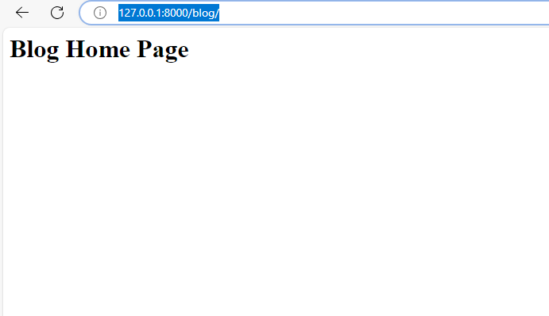
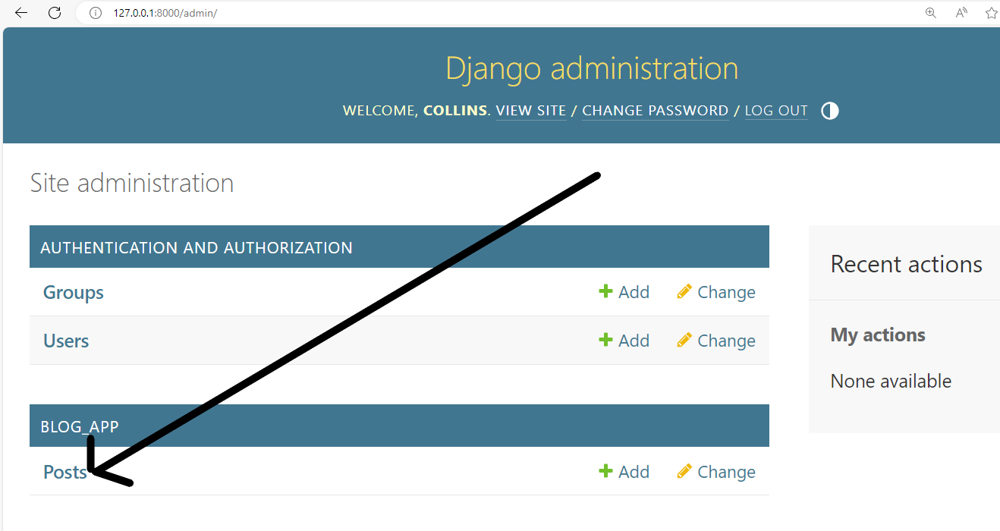
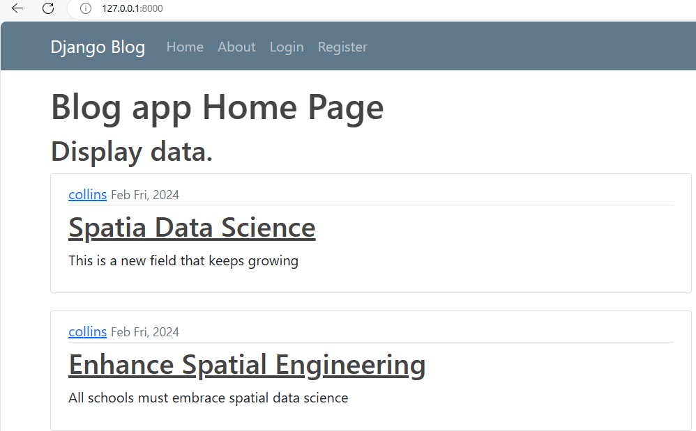
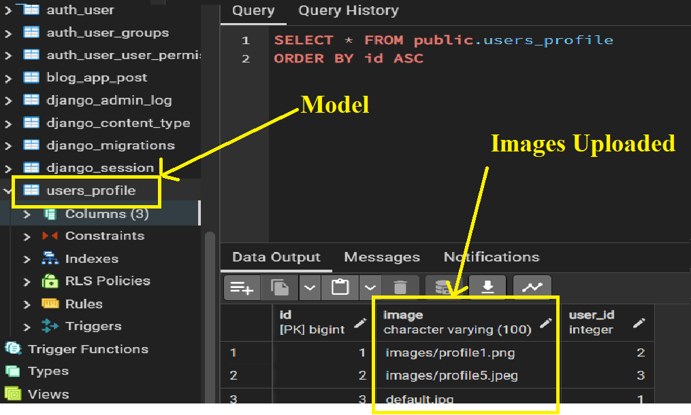

# Blog-App
A blog application created using Django.
Users with different level of authorizations can log in, write posts, update profile information and many  more features.


## **Table of Contents**

### 1. Setup
    - Setup virtual environment named myenv and activate
    - Install dependencies - Django
    - Setup Django project give it a name , web_app
    - Start application name blog_app
    - set PostgreSQL database   

My guide to [setting up](https://realpython.com/django-setup/).

Always activate the virtual when reopening the application. 

### 2. Routing applications.

Views are used used to return responses, our app folder contains this python file with necessary functions. I will write a simple function that will return a simple statement when a user goes to the homepage. 

```python
def home(request):
    return HttpResponse("<h1>Blog Home Page</h1>")
``` 

The above function needs to be mapped to a URL path for it to be executed via a call. This is achieved by simply creating a `url` python file inside the blog application, this is specific to the blog application.

This function is to be routed in the root directory `url` file by importing include and then adding a path that references `url` file in the blog_app application. 

```python
from django.urls import path, include

urlpatterns = [
    path('admin/', admin.site.urls),
    path('blog/', include('blog_app.urls')),
]
```
Run server and add path to blog in the address bar ,  http://127.0.0.1:8000/blog/



### 3. Templates.
HTML files are created using templates, they must be located inside a templates folder in our application with a subdirectory with the same name as application. We need two html files, one to direct users to our home page and another to about page. 

Django must be notified of the new app, housing templates, by adding it inside the settings.py file in the installed app list. 

To load the templates created, we need to point blog_app views to use them. I would rather the home view display a html file than a simple html tag. Activate the changes by making the view return and render our static home html file. Run server again to view the changes. 

```python
def home(request):
    return render(request, 'blog_app/home.html', )
```
#### 3.1 Base Templates.
In our two templates, home and about, there are a lot of redundant code. Code repeats in multiple locations making it less efficient. Multiple sections such as header, title, and footer can be placed in another base template then inherited by other templates. So the home and about html file will extend this template and add only code that is unique to them. 

```html

<!DOCTYPE html>
<html lang="en">
<head>
    <meta charset="UTF-8" />
    <meta name="viewport" content="width=device-width, initial-scale=1.0" />

    <!-- my css -->
    <link rel="stylesheet" type="text/css" href="">
    <!-- Title  -->
    
        <title>BLOG - {{ title }}</title>
    
        <title>Title</title>
    
</head>
<body>
     
    
</body>
</html>
```

#### 3.2 Static files.
JavaScript, CSS and image files used in templates are stores in static folder inside the project directory. Django accesses these files by loading the static folder in the base template. 

#### 3.3 Bootstrap.
Bootstrap is a power, feature rich toolkit used to build responsive websites using pre built components. This module was access through a CDN link and used to make beautify the header, rooter and content of our templates. 


### 4. Database Management. 
Django works with relational databases such as SSQLite(in-built) or Postgres. All database systems supported by Django use the language SQL to create, read, update and delete data in a relational database. SQL is also used to create, change, and delete the database tables themselves. An admin site is used to manage models in the database.  

#### 4.1 Admin page
Admin application is used to manage data through CRUD operations and view registered models in the backend making production efficient. Admin page configurations are automatically created when a user creates a project, all we need now is creating a super user and pass credentials at the command line. User information will be stored in auth_user table stored in the database after applying migrations. 

```bash
py manage.py createsuperuser
```
Admin page.


To view our model in the admin page we need to import and register it in the admin python file inside the app directory.
Registered model.


#### 4.2 Django ORM.
Django's Object Relational Mapper makes life easier by abstracting complex SQL queries. It allows users to easily manipulate data form the database using object oriented programming. 
- We need to only define a model class in a python file and apply migrations to effect changes in the database, no data definition query knowledge is needed. 
- Repetition is greatly reduced by migrations because one creates a model but does not write an SQL query again to create a table. 
- Migrations apply changes in the database dynamically, the need to create a complex data manipulation SQL query is avoided. 

#### 4.3 Define a model. 
A model is a single definitive source of information about data. In order to access user data for each post they make, a model Post is defined, its attributes are stored in fields in models python file. In Python models are classes with tables while attributes map into a column in the database. 

Django has a standard model that is used to manage user accounts in the Authentication package. A user is the author of a post, we therefore need to import User model, a separate table having one to many relationship with Post table associated using a foreign key. 

Sample Post model.
```python
class Post(models.Model):
    title = models.CharField(max_length=100)
    content = models.TextField()
    date = models.DateTimeField(default=timezone.now)
    # Foreign key
    author = models.ForeignKey(User, on_delete=models.CASCADE)

    def __str__(self):
        return self.title
```
Make migrations from the shell.

Post model in the database.


Users model in database.


Foreign key in Post table referencing User table.


#### 4.4 Query database model.
ORM provides us with a way to interact with models in the database. Run shell command 

```shell
py manage.py shell
```
Query users by retrieving all objects. 
```shell
>>> from blog_app.models import Post
>>> from django.contrib.auth.models import User
>>> User.objects.all()
<QuerySet [<User: collins>]>
```

Filter data.

```shell
>>> User.objects.first()
<User: collins>
>>> User.objects.filter(username='collins')
<QuerySet [<User: collins>]>
>>> User.objects.filter(username='collins').first()
<User: collins>
```

Store filtered query.

```shell
>>> u1 = User.objects.filter(username='collins').first()
>>> u1
<User: collins>
```

User attributes.
```shell
>>> u1.id
1
>>> u1.pk
1
>>> u1.last_login
datetime.datetime(2024, 2, 23, 7, 31, 57, 175213, tzinfo=datetime.timezone.utc)
```

Get user by attribute.
```shell
>>> user = User.objects.get(id=1)
>>> user
<User: collins>
```

Create posts using different methods.

```shell
>>> post_1 = Post(title='Spatia Data Science',content='This is a new field that keeps growing',author=user)
>>> post_1.save()
>>> Post.objects.all()
<QuerySet [<Post: Spatia Data Science>]>
>>> post_3 = Post(title='Remote sensing and GIS',content='Used in spatial analysis like Land cover mapping', author_id=user.id)
>>> post_3.save()
>>> Post.objects.all()
<QuerySet [<Post: Spatia Data Science>, <Post: Enhance Spatial Engineering>, <Post: Remote sensing and GIS>]>
```

Get attributes of Post model.
```shell
>>> post_3.author
<User: collins>
>>> post_3.content
'Used in spatial analysis like Land cover mapping'
```

Fetch User model(parent table) data from Post model(child) using foreign key, get author email.
```shell
>>> post_3.author.email
'collins@gmail.com'
```

Fetch all the posts written by a user without performing a join analysis, use sets. Add related table name set.
```shell
>>> user_1 = User.objects.get(id=1)
>>> user_1
<User: collins>
>>> user_1.post_set
<django.db.models.fields.related_descriptors.create_reverse_many_to_one_manager.<locals>.RelatedManager object at 0x00000238A99065A0>
>>> user_1.post_set.all()
<QuerySet [<Post: Spatia Data Science>, <Post: Enhance Spatial Engineering>, <Post: Remote sensing and GIS>]>
```

Create a post directly using set, then query post table.
```shell
>>> user_1.post_set.create(title='AI in GIS',content='There are many algorithms suck KNN in GIS')
<Post: AI in GIS>
>>> Post.objects.all()
<QuerySet [<Post: Spatia Data Science>, <Post: Enhance Spatial Engineering>, <Post: Remote sensing and GIS>, <Post: AI in GIS>]>
```
Note that we did not specify the author of the post nor save the post like previously done. 

#### 4.5 Add queried data to views.
We can now access queried information from the database and display this information in our views. Import the Post class from the same directory file model.py and grab data into a dictionary. 

```python
from django.shortcuts import render
from .models import Post

def home(request):
    # grab data into a dictionary
    context = {
        'posts':Post.objects.all()
    }
    return render(request, 'blog_app/home.html', context)
```

Run server and go to home page. 


### 5. User Registration.
We are going to create an application that allows users to login from the front end by creating accounts and signing in with their own credentials. 

A logically separate application needs to be created to manage users. This user application will have its own form, routes and other features that are independent. Since users cannot use the admin page to sign in, we need to design a registration page that contains a form as the first step. A form is used to pass in information from front end to backend python. It will verify user details such matching password, email validation, field validation, and rendering error messages as well as old values. 

Django does much of the heavy lifting i.e validation by simply automating tasks using pre built forms. Depending on user needs, this framework is extremely flexible as programmers can customize these forms when they need to scale up.

#### 5.1 Create User Application. 
In the project directory, we will create a new class to model user application. This app will handle all the functionalities related to users sign up.

```sh
py manage.py startapp users
```

Add application to installed apps variable in setting python file.

```python
# Application definition

INSTALLED_APPS = [
    'django.contrib.admin',
    'django.contrib.auth',
    'django.contrib.contenttypes',
    'django.contrib.sessions',
    'django.contrib.messages',
    'django.contrib.staticfiles',
    'blog_app',    # first app
    'users',      # second appp
]
```

#### 5.2 Design form.
Django comes with pre-built user authentication systems. User logins can be enabled by importing authentication systems. User objects form the building blocks of an authentication system. Developers create new users by using a build-in module,`UserCreationForm`, it contains three basic attributes, **username**, **password1** and **password2**, they are minimum requirements needed to have an authentication system. 
A registration form has to be rendered by a function, in this case, **registration**, defined in `views.py` file in users application. A new user is created by creating an instance of a built in user form. To access the form from the html file, we need to pass in as context in a dictionary.  

```python
from django.shortcuts import render
from django.contrib.auth.forms import UserCreationForm

# define function that instantiates a form
def registration(request):
    form = UserCreationForm()  # Instance with blank form
    return render(request, 'users/register.html', {'form': form})
```
Create template folder in users folder structure, add a subfolder with the name users *(must be similar to application name)*, add a new file ,`register.html`. This template receives the form and renders it in our page. 

Folder structure.
```
├── web_app
│   ├── users
│   │   ├── templates
│   │   │   ├── users
│   │   │   │   ├── register.html
```

This html file will extend from base html file. 

```html


    <h1>Registration Form.</h1>
    <br>
    <div class="content-section">
        <form method="POST">
             
            <fieldset class="form-group">
                <legend class="border-bottom mb-4">Join Today - Coles Blog App</legend>
                <!-- Render form as paragraph -->
                {{ form.as_p }}
            </fieldset>
            <div class="form-group">
                <button class="btn btn-outline-info" type="submit">Register</button>
            </div>
        </form>
        <div class="border-top pt-3">
            <small class="text-muted">
                Already Have An Account? <a class="ml-2" href="#">Sign In</a>
            </small>
        </div>
    </div>
   

```
Finally, to display the form we need to add a URL pattern that handles the request. Go to the web_app project `urls.py`, import registration view, add path and give it a name. 

```python
from django.contrib import admin
from django.urls import path, include
from users import views as users_view

urlpatterns = [
    path('admin/', admin.site.urls),
    path('', include('blog_app.urls')),
    path('register/', users_view.registration, name='register'),
]
```

Run server and go to register page , http://127.0.0.1:8000/register/

Without the form method `as_p` the page doesn't look appealing, see below ;

With method              |   No method 
:-------------------:|:------------------:
|

The form has multiple validation information that guides the user, number of characters and type of password required. All these functionalities provided for no need to be hard coded. Django is amazing !!

#### 5.3 Collect data from form.
In our form we did not specify the location to store data collected, thus after user entered details, they were redirected to the same page with an empty form. 

When you send data to a server, POST request are used, otherwise if you expect data a GET method is preferred. Both are HTTTP protocol used for data exchange. POST method is also designed to transfer data with secret information from the server to backend i.e passwords. They are also best suited for submitting data especially ones with multiple fields such as those in forms. 

We need to verify the POST method then validate the data inside message body else(GET request) display a blank form. A valid form contains the correct python data types, converted to JSON format. Backend user will be notified that data was successfully summited and user redirected to the home page. For this reason we need to capture username field and display a success message. 

```python
# import redirect and message functions
from django.shortcuts import render, redirect
from django.contrib.auth.forms import UserRegisterForm
from django.contrib import messages


def register(request):
    # validate method 
    if request.method == 'POST':
        # Get data 
        form = UserRegisterForm(request.POST)
        # Validate form
        if form.is_valid():
            form.save()    # save infor

            # Success message
            username = form.cleaned_data.get('username')
            messages.success(request, f'{username} Successfully created an Account!')
            
            # Redirect to home page 
            return redirect('blog-home')
        
    # GET method
    else:
        form = UserRegisterForm()
    return render(request, 'users/register.html', {'form': form})
```

The base template needs to be updated to display the flash messages just above the content block. 

```html
<div class="col-md-8">
    # <!-- Success message. -->
    
        
        <div class="alert alert-{{ message.tags }}">
            {{ message }}
        </div>
        
    
    
</div>
```

#### 5.4 Customize the form.
Our current form does not contain an email field, we need to add this attribute so that it can be fetched. We will create a new form, within `form.py` file in the Users root directory, that will inherit form the current one then add new fields and specify the model that will interact with it. 

```python
from django import forms
from django.contrib.auth.models import User
from django.contrib.auth.forms import UserCreationForm

# Inherit from user form and add fields 
class UserRegisterForm(UserCreationForm):
    email = forms.EmailField()

    class Meta:
        model = User
        fields = ['username', 'email', 'password1', 'password2']
```
To effect the above changes, we simply override previously created form `UserCreationForm` within `views.py` file with imported `UserRegisterForm`. 

```python
from django.shortcuts import render, redirect
from django.contrib import messages
from .forms import UserRegisterForm


def register(request):
    # validate method 
    if request.method == 'POST':
        # instatiate form and grab data
        form = UserRegisterForm(request.POST)
        # Validate form
        if form.is_valid():
            # form.save()    # save user data 

            # Success message
            username = form.cleaned_data.get('username')
            messages.success(request, f'{username} Successfully created an Account!')
            
            # Redirect to home page 
            return redirect('blog-home')
        
    # GET method
    else:
        form = UserRegisterForm()
    return render(request, 'users/register.html', {'form': form})
```

New Form with email field ;


#### 5.5 Enhance form appearance. 
Our form needs an enhanced styling i.e color error notifications to make them more visible or reduce their fonts. Django-crispy-forms provides us with the best tool to control rendering behavior for our forms. It contains built in CSS framework like bootstrap, tailwind, bootsrap5 etc., to use any of these packages, a packed must be selected inside `settings.py` file. In addition it also saves us a lot of time and effort that is if we opted for default Django. This third party module uses tags on templates to render elegant features in a way similar to bootstrap. In the virtual environment install `django-crispy-forms` then link the application to our website. We also need to install and update to boostrap-5 since our template is using a slightly older version.

```shell
(myenv) F:\Blog-App\myenv>pip install django-crispy-forms
(myenv) F:\Blog-App\myenv>pip install crispy-bootstrap5

(myenv) F:\Blog-App\myenv> pip freeze
asgiref==3.7.2
crispy-bootstrap5==2024.2
Django==5.0.2
django-crispy-forms==2.1
psycopg2==2.9.9
sqlparse==0.4.4
tzdata==2024.1
```
Notify Django of new apps in `settings.py`

```python
# Application definition

INSTALLED_APPS = [
    'django.contrib.admin',
    'django.contrib.auth',
    'django.contrib.contenttypes',
    'django.contrib.sessions',
    'django.contrib.messages',
    'django.contrib.staticfiles',
    # new apps
    'blog_app',
    'users',
    'crispy_forms',
    'crispy_bootstrap5',
]


# Set default template pack for boostraps features.
CRISPY_ALLOWED_TEMPLATE_PACKS = "bootstrap5"

CRISPY_TEMPLATE_PACK = "bootstrap5"

```

Crispy uses filter/tags on form elements, our previous tag `as_p` method is reduntant since better capabilities can be found with bootstrap. In our base template add ;

```html
{% load crispy_forms_tags % }

<form method="post" class="uniForm">
    {{ form|crispy }}
</form>
```

New form appearance      |  Form errors appearance 
:----------------------:|:------------------:
 | 


### 6. User Authentication System.
Django comes with built in authorization and authentication(‘permission’) forms from the Django contrib module. These features can be used to verify credentials buy defining logins and logouts. 

Previously only a superuser admin could log in so as to enable other users to access the frontend, we need to build a login and logout pages. Authentication views are defined at project level URL module. Each view must be differentiated by name using extensions. 

#### 6.1 Create a login template. 
We will create these pages in users app template folder, then add their paths inside project level `urls` file then notify Django to lookup for them by passing it as an argument to `as_view()` function.
Django already has installed auth application(check INSTALLED APP variable in settings file) to handle login, logout, password change, password reset and many more. Its important to note it does not include a sign up view that's why we have to configure this by ourselves. To add this application we must include it in our project blogg_app URL file.

```python
from django.contrib import admin
from django.urls import path, include
from users import views as users_views
from django.contrib.auth import views as auth_views   # new

urlpatterns = [
    path('admin/', admin.site.urls),
    path('', include('blog_app.urls')),
    path('register/', users_views.register, name='register'),

    # auth views 
    path('login/', auth_views.LoginView.as_view(template_name='users/login.html'), name='login'),
]
```

Create the login html page in Users app template folder, within user, extend the base template and pass is the form that views will be parsing. 

By default Django will look for registration folder to locate login or logout templates, hence we need to pass a name as a variable inside as_view() function. 

In the log in page, if user doesn't have an account, using href tags, we will direct them to the registration page by adding link ; ``. While in the registration page if a user had already registered we need to add a link to the login page in sign in tag ; `''`

Login template
```html


 


    <h1>Login Form.</h1>
    <br>
    <div class="content-section">
        <form method="POST">
             
            <fieldset class="form-group">
                <legend class="border-bottom mb-4">Log In</legend>
                <!-- Render form with bootstrap -->
                {{ form|crispy }}
            </fieldset>
            <div class="form-group">
                <button class="btn btn-outline-info" type="submit">Login</button>
            </div>
        </form>
        <div class="border-top pt-3">
            <small class="text-muted">
                Create Account ? <a class="ml-2" href="">Sign In</a>
            </small>
        </div>
    </div>
   

```

Registration template

```html


 


    <h1>Registration Form.</h1>
    <br>
    <div class="content-section">
        <form method="POST">
             
            <fieldset class="form-group">
                <legend class="border-bottom mb-4">Join Today - Coles Blog App</legend>
                <!-- Render form with bootstrap -->
                {{ form|crispy }}
            </fieldset>
            <div class="form-group">
                <button class="btn btn-outline-info" type="submit">Sign Up</button>
            </div>
        </form>
        <div class="border-top pt-3">
            <small class="text-muted">
                Already Have An Account? <a class="ml-2" href="">Sign In</a>
            </small>
        </div>
    </div>
   

```

#### 6.2 Test login page with different users. 
Trying to access a users account that had already been created  raises an error as seen below. This is because Django is trying to access a URL that does not have a view(/accounts/profile/) attached to it. This is Django functionality, its set up such that after a user successfully login it redirects them to accounts profile page, we can modify this route so that after a successful logging, a home page is opened. 

Form errors appearance


This 'Page not found' error can be corrected by adding a route where Django will access after users login successfully. Open the settings file and setup a logging redirect path to the blogg's home page. This variable is given a value that represents a link, in our case the name give to home page link. 

```python
LOGIN_REDIRECT_URL = 'blog-home'
```

Now again we try to login with a valid user credential, users are now redirected to the home page. 

 


Currently only the superuser can access the admin page after logging to their page, else it raises and error as seen bellow;


Currently users are redirected to the home page after creating an account, this is enabled by `register` function(see section 5.4). This can be modified to allow them be redirected to the login page after they have been authenticated. Simply change the value returned by the above function and the success message to fit this purpose. 
Lets create a new user by heading to register page- My guide to register-link - *https:http://127.0.0.1:8000/register/*

```python
# Change function in users app url.py 

def register(request):
    # validate method 
    if request.method == 'POST':
        # Get data 
        form = UserRegisterForm(request.POST)
        # Validate form
        if form.is_valid():
            form.save()    # save user data 

 # ---->        Change 1
            # Changed Success message
            username = form.cleaned_data.get('username')
            messages.success(request, f'Hi {username}, You have successfully been verified, procced to loging!')
            
 # ----->       Change 2
            # Redirect to login page 
            return redirect('login')
        
    # GET method
    else:
        form = UserRegisterForm()
    return render(request, 'users/register.html', {'form': form})
```

#### 6.3 Create Logout Template.
In our `web_app` url.py file, we will add a path to logout page from auth app by including it inside `urlpatterns` list.
```python

    # from auth app
    path('login/', auth_views.LoginView.as_view(template_name='users/login.html'), name='login'),
    # New line 
    path('logout/', auth_views.LogoutView.as_view(), name='logout'),
```
Default log out page for Django :


The page exposes unwarranted individual users to the admin section, this can be corrected by customizing a html page and then passing this template as a variable to `as_view()` function. The file will be located in the same directory as the login template.
```python
    # New line 
    path('logout/', auth_views.LogoutView.as_view(template_name='users/logout.html'), name='logout'),

```
Customized log out page :


#### 6.4 Navigation Page.
Currently our navigation panel does not update when a user is logged in or signed out, i.e if one is logged in, a logout link should appear and vice versa. A user can be authenticated in the base template by adding a control measure to check status. First attach a link to the logout and register buttons, i.e `href=""`. Django gives us access to a User variable that has attribute `is_authenticated`, it checks log status. In the base html, We will create a python condition; if user is logged in then display logout button else display register button. 

```html
    <!-- Items on the left -->
    <div>
        <ul class="navbar-nav">
        
            <span class="navbar-text">Logged in as {{user.username}} | </span>
        <!-- login link -->
            <li class="nav-item">
                <a class="nav-link" href="">Logout</a>
            </li>
        
        <!-- link for registering -->
            <li class="nav-item">
                <a class="nav-link" href="">Register</a>
            </li>
        
        </ul>
    </div>
```
New Log Out Page  |  New Home Page Login feature 
:----------------------:|:------------------:
 | 

#### 6.5 Create Profile Page.
A profile page is necessary to ensure that a user must sign up or log in so as to access the application. This page displays user biodata i.e profile images. The bigger advantage is that is sets a restriction on certain routes i.e one must be signed and logged in to view the home page and other app features. 

Create function, in the app view, that renders the page. 
```python
# Render a profile template 
def profile(request):
    return render(request, 'users/profile.html')
```

A template `profile.html` that simply shows user name is added to users template folder. 
```html
    

    
        <h1>{{ user.username }} Profile Page.</h1>
    
    
```

A route that utilizes this view is also needed, navigate to project's URL file ;

```python
urlpatterns = [

# New code 
# ---->  profile link 
    path('profile/', users_views.profile, name='profile'),
]
```

Our application must have a link to the profile page for users to view their data, we can incorporate a link(to profile page) in the header section of base html only when they are logged in. 
```html
        <!-- Items on the left -->
        <div>
          <ul class="navbar-nav">
             

        <!-- New Line -->
              <!-- Link to profile  -->
              <li class="nav-item">
                <a class="nav-link" href="">Profile</a>
              </li>
        <!-- ----------------- -->

              <!-- Display user name -->
            

            
              </ul>
        </div>
```

Restrict the page to users who are logged in, this is achieved through a Django decorator. Decorators are functions that change / enhance the behaviors of objects without altering their state, in our case, we need to enable `profile` view only if user is signed in. From Django's auth module import decorators into Users `urls` file ;

```python

from django.contrib.auth.decorators import login_required

# Render a profile template
@login_required
def profile(request):
    return render(request, 'users/profile.html')

```

Django must be notified of a login route else it will search for the file in a default account/ route. This error is corrected by adding a login `URL` variable in the settings file. This way, when users try searching a profile page, they are redirected to a login page. 

```python

LOGIN_REDIRECT_URL = 'blog-home'

# New code 
LOGOUT_URL = 'login'
```
Run server and go to profile link - http://127.0.0.1:8000/profile 

Note that if your are  not logged in, you are redirected to the sing in page then automatically to the profile page. This is a Django feature that enables easy navigation for users. 


### 7. Enhance User Profile. 
When users access their profile page they need to view their data information that includes an image uploaded by themselves. This adds more interactivity and intuitiveness to our page. First we need to install pillow library containing functions that process images in Django, then design a model that will hold the field containing image property, this model will have a one-to-one relationship with our User model. Next we have to configure a `MEDIA_ROOT` that will store all the images uploaded, it can also contain videos or audio files. 

#### 7.1 Install Pillow Library.
Always remember to activate the virtual environment whenever you restart application. Pillow supports many image formats such as `.jpeg` and `.png` ,without this library an error is raised. 

Code for installing this library in the command line ;

```shell
pip install pillow 

# Check installed apps
pip freeze 
```

#### 7.2 Add Image Model. 
By extending the built-in `User` model to add an image field, Django will link the image uploaded to a specific user. This is define by the relationship declared, a user can only have one profile image and one image is associated to a single user. Head over to the Users application, in the models.py file, create model. 

```python

from django.contrib.auth.models import User    # new

# Image model 
class Profile(models.Model):
    # Define relationship
    user = models.OneToOneField(User, on_delete=models.CASCADE)
    # parameters :Default image when a user doesn't have an image, folder to store images
    image = models.ImageField(default='default.jpg', upload_to='images/')

    def __str__(self):
        return f'{self.user.username} Profile'
```
Register the model to view it in the admin page.

```python
from .models import Profile  # new 

admin.site.register(Profile)  # new 
```

#### 7.3 Add `MEDIA_ROOT` and `MEDIA_URL`
The 'upload_to' parameter in image field tells Django where to find images that has been uploaded, it must be a child folder of Media root folder that store user uploaded images. In the settings file, add a media subfolder under the Root directory (`web_app`). For Django to locate any media file such i.e. an image, a URL path must be defined also within the settings.py file. Every item within this folder must start with the folder name then followed by file name. 

```python
MEDIA_ROOT = BASE_DIR/'media'
MEDIA_URL = '/media/'
```

Apply and make migration to effect changes in the database then run server and log in as superuser so as to access admin page where we will upload an image for each user from our local directory. Only the admin can add multiple images for each user. Then query the database from the shell to view location of images.  After adding images, at the root folder note media folder and image subfolder containing images have been added automatically. 

User1 Profile in admin page  |  User2 Profile in admin page
:----------------------:|:------------------:
 | 


Profile model in the database.



Querying database after stopping the server. Get image associated to a user from the profile model by stringing. 
```shell
# User with default image 
>>> user = User.objects.filter(username='collins').first()
>>> user
<User: collins>
>>> user.profile.image
<ImageFieldFile: default.jpg>
# Image path
>>> user.profile.image.url
'/media/default.jpg'


# User with profile image uploaded
>>> user2 = User.objects.filter(username='cole').first()
>>> user2
<User: cole>
# Image properties
>>> user2.profile.image.width
225


# Access profile of a user directly from the user model
>>> user2.profile
<Profile: cole Profile>
>>> user2.profile.image
<ImageFieldFile: images/profile1.png>
>>> user2.profile.image.url
'/media/images/profile1.png'
```
Exit shell with `exit()` command. 


#### 7.4 Update Profile Page.
A user profile should display data such as : name, email and their image in this page. First add a URL pattern for media files in our project's `url.py` file. Serving user uploaded media files from `MEDIA_ROOT` during testing and development use Django's static server() view

```python
# ------>    new code 
# User uploaded media files methods 
from django.conf import settings
from django.conf.urls.static import static

# ---->      new code 
if settings.DEBUG:
    urlpatterns += static(settings.MEDIA_URL, document_root=settings.MEDIA_ROOT)
```

Django template variable is used to access data from the database, render in html file, and style them using CSS features. 


[//]: # (NEXT <> Part 8 , )
