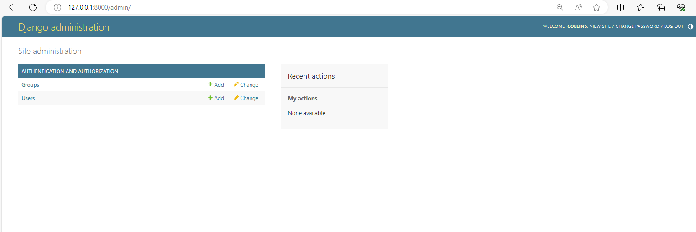

# Blog-App
A blog application created using Django.
Users with different level of authorisations can log in, write posts, update profile information and many  more features.


## **Table of Contents**

### 1. Setup
    - Setup virtual enviroment named myenv and activate
    - Install dependancies - Django
    - Setup Django project give it a name , web_app
    - Start application name blog_app   

    My guide to [setting up](https://realpython.com/django-setup/).

### 2. Routing applications.

Views are used used to return responses, our app folder contains this python file with neccesesary functions. I will write a simple function that will return a simple statement when a user goes to the homepage. 

```python
def home(request):
    return HttpResponse("<h1>Blog Home Page</h1>")
``` 

The above function needs to be mapped to a url path for it to be executed via a call. This is achieved by simply creating a url python file inside the blog application, this is specific to the blog application.

The above must also be routed in the root directory url file, import include and add a path that references url file in the blog_app application. 

```python
from django.urls import path, include

urlpatterns = [
    path('admin/', admin.site.urls),
    path('blog/', include('blog_app.urls')),
]
```
Run server and add path to blog in the address bar ,  http://127.0.0.1:8000/blog/


### 3. Templates.
HTML files are created using templates, they must be located inside a templates folder in our application with a subdirectory with the same name as application. We need two html files, one to direct users to our home page and another to about page. 

Django must be notified of the new app, housing templates, by adding it inside the settings.py file in the installed app list. 

To load the templates created, we need to point blog_app views to use them. I would rather the home view display a html file than a simple html tag. Activate the changes by making the view return and render our static home html file. Run server again to view the changes. 

```python
def home(request):
    return render(request, 'blog_app/home.html', )
```
#### 3.1 Base Templates.
In our two templates, home and about, there are alot of redundant code. Code repeats in multiple locations making it less efficient. Multiple sections such as header, title, and footer can be placed in another base template then inherited by other templates. So the home and about html file will extend this template and add only code that is unique to them. 

```html

<!DOCTYPE html>
<html lang="en">
<head>
    <meta charset="UTF-8" />
    <meta name="viewport" content="width=device-width, initial-scale=1.0" />

    <!-- my css -->
    <link rel="stylesheet" type="text/css" href="">
    <!-- Title  -->
    
        <title>BLOG - {{ title }}</title>
    
        <title>Title</title>
    
</head>
<body>
     
    
</body>
</html>
```

#### 3.2 Static files.
JavaScript, css and image files used in templates are stores in static folder inside the project directory. Django accesses these files by loading the static folder in the base template. 

#### 3.3 Boostrap.
Boostrap is a power, feature rich toolkit used to build responsive websites using pre built components. This module was access through a CDN link and used to make beautify the header, rooter and content of our templates. 


### 4. Database Management. 
Django works with relational databases such as SQlite(in-built) or Postgres. All database systems supported by Django use the language SQL to create, read, update and delete data in a relational database. SQL is also used to create, change, and delete the database tables themselves. An admin site is used to manage models in the database.  

#### 4.1 Admin page
Admin application is used to manage data through CRUD operations and view registered models in the backend making production efficient. Admin page configurations are automatically created when a user creates a project, all we need now is creating a super user and pass credentials at the command line. User information will be stored in auth_user table stored in the database after applying migrations. 

```bash
py manage.py createsuperuser
```
Admin page.


#### 4.2 Django ORM.
Django's Object Relational Mapper makes life easier by abstracting complex SQL queries. It allows users to easily manipulate data form the database using object oriented programming. 
- We need to only defeine a model class in a python file and apply migartions to effect changes in the database, no data definition query knowledge is needed. 
- Repetition is greatly reduced by migrations because one creates a model but does not write an SQL query again to create a table. 
- Migrations apply changes in the databese dynamically, the need to create a complex data manipulation sql query is avoided. 

#### 4.3 Define a model. 
A model is a single deifitive source of information about data. In order to access user data for each post they make, a model Post is defined, its attributes are stored in fields in models python file. In Python models are classes with tables while attributes map into a column in the database. 

Django has a standard model that is used to manage user accounts in the Authentication package. A user is the author of a post, we therefore need to import User model, a separate table having one to many relationship with Post table associated using a foreign key. 

Sample Post model.
```python
class Post(models.Model):
    title = models.CharField(max_length=100)
    content = models.TextField()
    date = models.DateTimeField(default=timezone.now)
    # Foreign key
    author = models.ForeignKey(User, on_delete=models.CASCADE)

    def __str__(self):
        return self.title
```
Make migrations from the shell.

#### 4.4 Query database model.
ORM provides us with a way to interact with models in the database. Run shell command 

```shell
py manage.py shell
```
Query users by retrieving all objects. 
```shell
>>> from blog_app.models import Post
>>> from django.contrib.auth.models import User
>>> User.objects.all()
<QuerySet [<User: collins>]>
```

Filter data.

```shell
>>> User.objects.first()
<User: collins>
>>> User.objects.filter(username='collins')
<QuerySet [<User: collins>]>
>>> User.objects.filter(username='collins').first()
<User: collins>
```

Store filtered query.

```shell
>>> u1 = User.objects.filter(username='collins').first()
>>> u1
<User: collins>
```

User attributes.
```shell
>>> u1.id
1
>>> u1.pk
1
>>> u1.last_login
datetime.datetime(2024, 2, 23, 7, 31, 57, 175213, tzinfo=datetime.timezone.utc)
```

Get user by attribute.
```shell
>>> user = User.objects.get(id=1)
>>> user
<User: collins>
```

Create post.

```shell
>>> post_1 = Post(title='Spatia Data Science',content='This is a new field that keeps growing',author=user)
>>> post_1.save()
>>> Post.objects.all()
<QuerySet [<Post: Spatia Data Science>]>
```

Create a second post with the same user but using id to identify.
```shell

```


