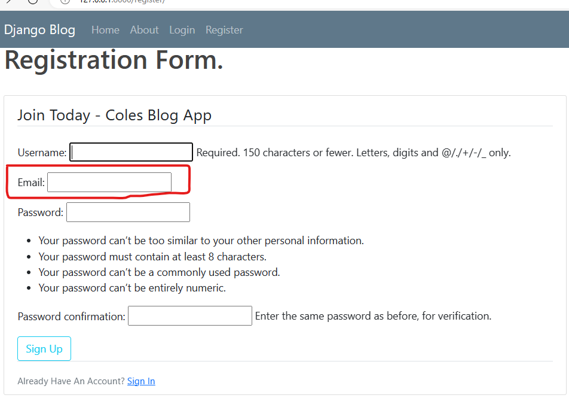
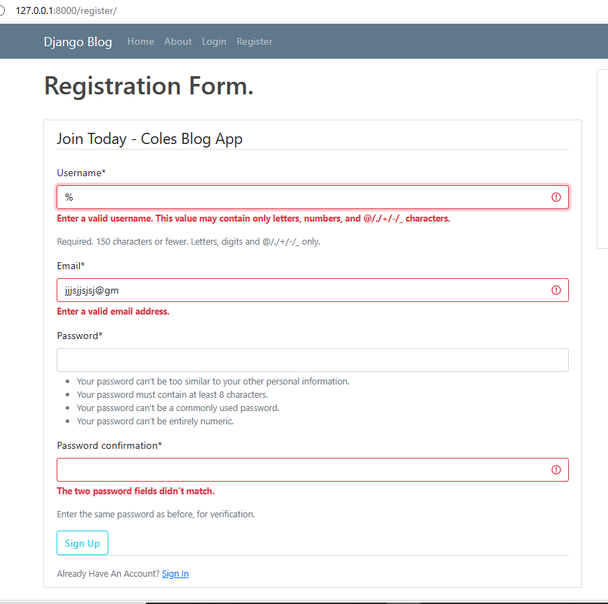
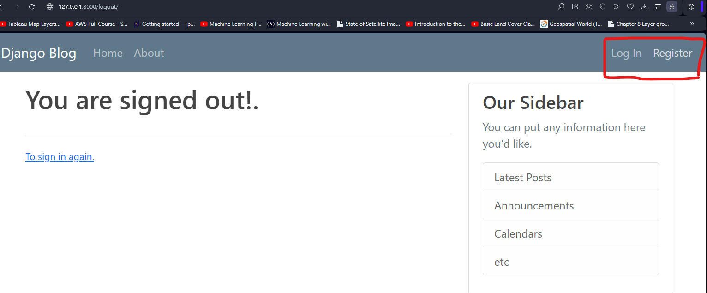
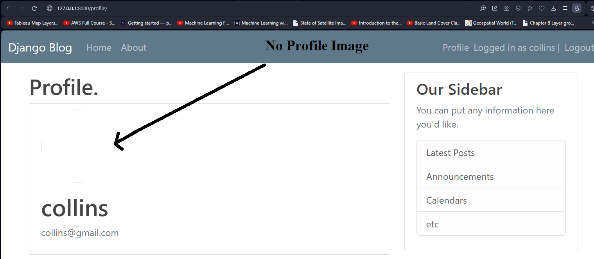
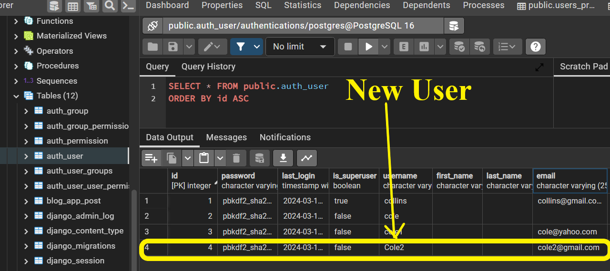
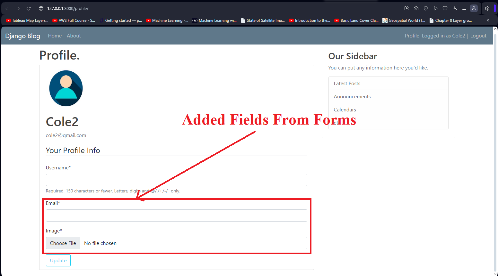

# Blog-App
A social network created using Django framework, the application follows the model-view-controller (MVC) architectural pattern, emphasizing the reusability and pluggability of components i.e class views. 

## Key Features.
- Object-Relational Mapping (ORM)
- Admin Interface Development
- URL routing
- Form Handling
- Authentication and Authorization
- Security using Cross Site Request Forgery
- Templates Design


## **Table of Contents**
1. [Setup.](#1-setup)
2. [Routing Application.](#2-routing-applications)
3. [Templates.](#3-templates)
4. [Database Management.](#4-database-management)
5. [User Registration.](#5-user-registration)
6. [User Authentication.](#6-user-authentication-system)
7. [User Profile](#7-enhance-user-profile)
8. [Forms](#8-upload-changes-in-profile-page)
9. [User Post](#9-design-user-post)
8. [](#)


## 1. Setup
    - Setup virtual environment named myenv and activate
    - Install dependencies - Django
    - Setup Django project give it a name , web_app
    - Start application name blog_app
    - set PostgreSQL database   

My guide to [setting up](https://realpython.com/django-setup/).

Always activate the virtual when reopening the application. 

## 2. Routing applications.

Views are used used to return responses, our app folder contains this python file with necessary functions. I will write a simple function that will return a simple statement when a user goes to the homepage. 

```python
def home(request):
    return HttpResponse("<h1>Blog Home Page</h1>")
``` 

The above function needs to be mapped to a URL path for it to be executed via a call. This is achieved by simply creating a `url` python file inside the blog application, this is specific to the blog application.

This function is to be routed in the root directory `url` file by importing include and then adding a path that references `url` file in the blog_app application. 

```python
from django.urls import path, include

urlpatterns = [
    path('admin/', admin.site.urls),
    path('blog/', include('blog_app.urls')),
]
```
Run server and add path to blog in the address bar ,  http://127.0.0.1:8000/blog/


## 3. Templates.
HTML files are created using templates, they must be located inside a templates folder in our application with a subdirectory with the same name as application. We need two html files, one to direct users to our home page and another to about page. 

Django must be notified of the new app, housing templates, by adding it inside the settings.py file in the installed app list. 

To load the templates created, we need to point blog_app views to use them. I would rather the home view display a html file than a simple html tag. Activate the changes by making the view return and render our static home html file. Run server again to view the changes. 

```python
def home(request):
    return render(request, 'blog_app/home.html', )
```
### **3.1 Base Templates.**
In our two templates, home and about, there are a lot of redundant code. Code repeats in multiple locations making it less efficient. Multiple sections such as header, title, and footer can be placed in another base template then inherited by other templates. So the home and about html file will extend this template and add only code that is unique to them. 

```html

<!DOCTYPE html>
<html lang="en">
<head>
    <meta charset="UTF-8" />
    <meta name="viewport" content="width=device-width, initial-scale=1.0" />

    <!-- my css -->
    <link rel="stylesheet" type="text/css" href="">
    <!-- Title  -->
    
        <title>BLOG - {{ title }}</title>
    
        <title>Title</title>
    
</head>
<body>
     
    
</body>
</html>
```

### **3.2 Static files.**
JavaScript, CSS and image files used in templates are stores in static folder inside the project directory. Django accesses these files by loading the static folder in the base template. 

### **3.3 Bootstrap.**
Bootstrap is a powerful, feature rich toolkit used to build responsive websites using pre built components. This module was access through a CDN link and used to make beautify the header, rooter and content of our templates. 


## 4. Database Management. 
Django works with relational databases such as SQLite(in-built) or Postgres. All database systems supported by Django use the language SQL to create, read, update and delete data in a relational database. SQL is also used to create, change, and delete the database tables themselves. An admin site is used to manage models in the database.  

### **4.1 Admin Page.**
Admin application is used to manage data through CRUD operations and view registered models in the backend making production efficient. Admin page configurations are automatically created when a user creates a project, all we need now is creating a super user and pass credentials at the command line. User information will be stored in auth_user table stored in the database after applying migrations. 

```bash
py manage.py createsuperuser
```
Admin page.


To view our model in the admin page we need to import and register it in the admin python file inside the app directory.
Registered model.


### **4.2 Django ORM.**
Django's Object Relational Mapper makes life easier by abstracting complex SQL queries. It allows users to easily manipulate data form the database using object oriented programming. 
- We need to only define a model class in a python file and apply migrations to effect changes in the database, no data definition query knowledge is needed. 
- Repetition is greatly reduced by migrations because one creates a model but does not write an SQL query again to create a table. 
- Migrations apply changes in the database dynamically, the need to create a complex data manipulation SQL query is avoided. 

### **4.3 Define a model.** 
A model is a single definitive source of information about data. In order to access user data for each post they make, a model Post is defined, its attributes are stored in fields in models python file. In Python models are classes with tables while attributes map into a column in the database. 

Django has a standard model that is used to manage user accounts in the Authentication package. A user is the author of a post, we therefore need to import User model, a separate table having one to many relationship with Post table associated using a foreign key. 

Sample Post model.
```python
class Post(models.Model):
    title = models.CharField(max_length=100)
    content = models.TextField()
    date = models.DateTimeField(default=timezone.now)
    # Foreign key
    author = models.ForeignKey(User, on_delete=models.CASCADE)

    def __str__(self):
        return self.title
```
Make migrations from the shell.

Post model in the database.


Users model in database.


Foreign key in Post table referencing User table.


### **4.4 Query database model.**
ORM provides us with a way to interact with models in the database. Run shell command 

```shell
py manage.py shell
```
Query users by retrieving all objects. 
```shell
>>> from blog_app.models import Post
>>> from django.contrib.auth.models import User
>>> User.objects.all()
<QuerySet [<User: collins>]>
```

Filter data.

```shell
>>> User.objects.first()
<User: collins>
>>> User.objects.filter(username='collins')
<QuerySet [<User: collins>]>
>>> User.objects.filter(username='collins').first()
<User: collins>
```

Store filtered query.

```shell
>>> u1 = User.objects.filter(username='collins').first()
>>> u1
<User: collins>
```

User attributes.
```shell
>>> u1.id
1
>>> u1.pk
1
>>> u1.last_login
datetime.datetime(2024, 2, 23, 7, 31, 57, 175213, tzinfo=datetime.timezone.utc)
```

Get user by attribute.
```shell
>>> user = User.objects.get(id=1)
>>> user
<User: collins>
```

Create posts using different methods.

```shell
>>> post_1 = Post(title='Spatia Data Science',content='This is a new field that keeps growing',author=user)
>>> post_1.save()
>>> Post.objects.all()
<QuerySet [<Post: Spatia Data Science>]>
>>> post_3 = Post(title='Remote sensing and GIS',content='Used in spatial analysis like Land cover mapping', author_id=user.id)
>>> post_3.save()
>>> Post.objects.all()
<QuerySet [<Post: Spatia Data Science>, <Post: Enhance Spatial Engineering>, <Post: Remote sensing and GIS>]>
```

Get attributes of Post model.
```shell
>>> post_3.author
<User: collins>
>>> post_3.content
'Used in spatial analysis like Land cover mapping'
```

Fetch User model(parent table) data from Post model(child) using foreign key, get author email.
```shell
>>> post_3.author.email
'collins@gmail.com'
```

Fetch all the posts written by a user without performing a join analysis, use sets. Add related table name set.
```shell
>>> user_1 = User.objects.get(id=1)
>>> user_1
<User: collins>
>>> user_1.post_set
<django.db.models.fields.related_descriptors.create_reverse_many_to_one_manager.<locals>.RelatedManager object at 0x00000238A99065A0>
>>> user_1.post_set.all()
<QuerySet [<Post: Spatia Data Science>, <Post: Enhance Spatial Engineering>, <Post: Remote sensing and GIS>]>
```

Create a post directly using set, then query post table.
```shell
>>> user_1.post_set.create(title='AI in GIS',content='There are many algorithms suck KNN in GIS')
<Post: AI in GIS>
>>> Post.objects.all()
<QuerySet [<Post: Spatia Data Science>, <Post: Enhance Spatial Engineering>, <Post: Remote sensing and GIS>, <Post: AI in GIS>]>
```
Note that we did not specify the author of the post nor save the post like previously done. 

### **4.5 Add queried data to views.**
We can now access queried information from the database and display in our views. Import the Post class from the same directory file model.py and grab data into a dictionary. 

```python
from django.shortcuts import render
from .models import Post

def home(request):
    # grab data into a dictionary
    context = {
        'posts':Post.objects.all()
    }
    return render(request, 'blog_app/home.html', context)
```

Run server and go to home page. 


## 5. User Registration.
We are going to create an application that allows users to login from the front end by creating accounts and signing in with their own credentials. 

A logically separate application needs to be created to manage users. This user application will have its own form, routes and other features that are independent. Since users cannot use the admin page to sign in, we need to design a registration page that contains a form as the first step. A form is used to pass in information from front end to backend python. It will verify user details such matching password, email validation, field validation, and rendering error messages as well as old values. 

Django does much of the heavy lifting i.e validation by simply automating tasks using pre-built forms. Depending on user needs, this framework is extremely flexible as programmers can customize these forms when they need to scale up.

### **5.1 Create User Application.** 
In the project directory, we will create a new class to model user application. This app will handle all the functionalities related to users sign up.

```sh
py manage.py startapp users
```

Add application to installed apps variable in setting python file.

```python
# Application definition

INSTALLED_APPS = [
    'django.contrib.admin',
    'django.contrib.auth',
    'django.contrib.contenttypes',
    'django.contrib.sessions',
    'django.contrib.messages',
    'django.contrib.staticfiles',
    'blog_app',    # first app
    'users',      # second appp
]
```

### **5.2 Design form.**
Django comes with pre-built user authentication systems. User logins can be enabled by importing authentication modules. User objects form the building blocks as developers create new users by using a built-in module,`UserCreationForm`, it contains three basic attributes, **username**, **password1** and **password2**, these are the minimum requirements for setting up an authentication system. 
A registration form has to be rendered by a function, in this case, **registration**, defined in `views.py` file in users application. A new user is created by creating an instance of a built in user form. To access the form from the html file, we need to pass in as context in a dictionary.  

```python
from django.shortcuts import render
from django.contrib.auth.forms import UserCreationForm

# define function that instantiates a form
def registration(request):
    form = UserCreationForm()  # Instance with blank form
    return render(request, 'users/register.html', {'form': form})
```
Create template folder in users folder structure, add a subfolder with the name users *(must be similar to application name)*, add a new file ,`register.html`. This template receives the form and renders it in our page. 

Folder structure.
```
├── web_app
│   ├── users
│   │   ├── templates
│   │   │   ├── users
│   │   │   │   ├── register.html
```

This html file will extend from base html file. 

```html


    <h1>Registration Form.</h1>
    <br>
    <div class="content-section">
        <form method="POST">
             
            <fieldset class="form-group">
                <legend class="border-bottom mb-4">Join Today - Coles Blog App</legend>
                <!-- Render form as paragraph -->
                {{ form.as_p }}
            </fieldset>
            <div class="form-group">
                <button class="btn btn-outline-info" type="submit">Register</button>
            </div>
        </form>
        <div class="border-top pt-3">
            <small class="text-muted">
                Already Have An Account? <a class="ml-2" href="#">Sign In</a>
            </small>
        </div>
    </div>
   

```
Finally, to display the form we need to add a URL pattern that handles the request. Go to the web_app project `urls.py`, import registration view, add path and give it a name. 

```python
from django.contrib import admin
from django.urls import path, include
from users import views as users_view

urlpatterns = [
    path('admin/', admin.site.urls),
    path('', include('blog_app.urls')),
    path('register/', users_view.registration, name='register'),
]
```

Run server and go to register page , http://127.0.0.1:8000/register/

Without the form method `as_p` the page doesn't look appealing, see below ;

With method              |   No method 
:-------------------:|:------------------:
|

The form has multiple validation information that guides the user, number of characters and type of password required. All these functionalities provided for no need to be hard coded. Django is amazing !!

### **5.3 Collect data from form.**
In our form we did not specify the location to store data collected, thus after user entered details, they were redirected to the same page with an empty form. 

When you send data to a server, POST request are used, otherwise if you expect data a GET method is preferred. Both are HTTTP protocol used for data exchange. POST method is also designed to transfer data with secret information from the server to backend i.e passwords. They are also best suited for submitting data especially ones with multiple fields such as those in forms. 

We need to verify the POST method then validate the data inside message body else(GET request) display a blank form. A valid form contains the correct python data types, converted to JSON format. Backend user will be notified that data was successfully summited and user redirected to the home page. For this reason we need to capture username field and display a success message. 

```python
# import redirect and message functions
from django.shortcuts import render, redirect
from django.contrib.auth.forms import UserRegisterForm
from django.contrib import messages


def register(request):
    # validate method 
    if request.method == 'POST':
        # Get data 
        form = UserRegisterForm(request.POST)
        # Validate form
        if form.is_valid():
            form.save()    # save infor

            # Success message
            username = form.cleaned_data.get('username')
            messages.success(request, f'{username} Successfully created an Account!')
            
            # Redirect to home page 
            return redirect('blog-home')
        
    # GET method
    else:
        form = UserRegisterForm()
    return render(request, 'users/register.html', {'form': form})
```

The base template needs to be updated to display the flash messages just above the content block. 

```html
<div class="col-md-8">
    # <!-- Success message. -->
    
        
        <div class="alert alert-{{ message.tags }}">
            {{ message }}
        </div>
        
    
    
</div>
```

### **5.4 Customize the form.**
Our current form does not contain an email field, we need to add this attribute so that it can be fetched. We will create a new form, within `form.py` file in the Users root directory, that will inherit form the current one then add new fields and specify the model that will interact with it. 

```python
from django import forms
from django.contrib.auth.models import User
from django.contrib.auth.forms import UserCreationForm

# Inherit from user form and add fields 
class UserRegisterForm(UserCreationForm):
    email = forms.EmailField()

    class Meta:
        model = User
        fields = ['username', 'email', 'password1', 'password2']
```
To effect the above changes, we simply override previously created form `UserCreationForm` within `views.py` file with imported `UserRegisterForm`. 

```python
from django.shortcuts import render, redirect
from django.contrib import messages
from .forms import UserRegisterForm


def register(request):
    # validate method 
    if request.method == 'POST':
        # instatiate form and grab data
        form = UserRegisterForm(request.POST)
        # Validate form
        if form.is_valid():
            # form.save()    # save user data 

            # Success message
            username = form.cleaned_data.get('username')
            messages.success(request, f'{username} Successfully created an Account!')
            
            # Redirect to home page 
            return redirect('blog-home')
        
    # GET method
    else:
        form = UserRegisterForm()
    return render(request, 'users/register.html', {'form': form})
```

New Form with email field ;


### **5.5 Enhance form appearance.** 
Our form needs an enhanced styling i.e color error notifications to make them more visible or reduce their fonts. Django-crispy-forms provides us with the best tool to control rendering behavior for our forms. It contains built in CSS framework like bootstrap, tailwind, bootsrap5 etc., to use any of these packages, a packed must be selected inside `settings.py` file. In addition it also saves us a lot of time and effort that is if we opted for default Django. This third party module uses tags on templates to render elegant features in a way similar to bootstrap. In the virtual environment install `django-crispy-forms` then link the application to our website. We also need to install and update to boostrap-5 since our template is using a slightly older version.

```shell
(myenv) F:\Blog-App\myenv>pip install django-crispy-forms
(myenv) F:\Blog-App\myenv>pip install crispy-bootstrap5

(myenv) F:\Blog-App\myenv> pip freeze
asgiref==3.7.2
crispy-bootstrap5==2024.2
Django==5.0.2
django-crispy-forms==2.1
psycopg2==2.9.9
sqlparse==0.4.4
tzdata==2024.1
```
Notify Django of new apps in `settings.py`

```python
# Application definition

INSTALLED_APPS = [
    'django.contrib.admin',
    'django.contrib.auth',
    'django.contrib.contenttypes',
    'django.contrib.sessions',
    'django.contrib.messages',
    'django.contrib.staticfiles',
    # new apps
    'blog_app',
    'users',
    'crispy_forms',
    'crispy_bootstrap5',
]


# Set default template pack for boostraps features.
CRISPY_ALLOWED_TEMPLATE_PACKS = "bootstrap5"

CRISPY_TEMPLATE_PACK = "bootstrap5"

```

Crispy uses filter/tags on form elements, our previous tag `as_p` method is redundant since better capabilities can be found with bootstrap. In our base template add ;

```html
{% load crispy_forms_tags % }

<form method="post" class="uniForm">
    {{ form|crispy }}
</form>
```

New form appearance      |  Form errors appearance 
:----------------------:|:------------------:
 | 


## 6. User Authentication System.
Django comes with built in authorization and authentication(‘permission’) forms from the Django `contrib` module. These features can be used to verify credentials buy defining logins and logouts. 

Previously only a superuser admin could log in so as to enable other users to access the frontend, we need to build a login and logout pages. Authentication views are defined at project level URL module. Each view must be differentiated by name using extensions. 

### **6.1 Create a login template.** 
We will create these pages in users app template folder, then add their paths inside project level `urls` file then notify Django to lookup for them by passing it as an argument to `as_view()` function.
Django already has installed `auth` application(check INSTALLED APP variable in settings file) to handle login, logout, password change, password reset and many more. Its important to note it does not include a sign up view that's why we have to configure this by ourselves. To add this application we must include it in our project `blog_app` URL file.

```python
from django.contrib import admin
from django.urls import path, include
from users import views as users_views
from django.contrib.auth import views as auth_views   # new

urlpatterns = [
    path('admin/', admin.site.urls),
    path('', include('blog_app.urls')),
    path('register/', users_views.register, name='register'),

    # auth views 
    path('login/', auth_views.LoginView.as_view(template_name='users/login.html'), name='login'),
]
```

Create the login html page in Users app template folder, within user, extend the base template and pass is the form that views will be parsing. 

By default Django will look for registration folder to locate login or logout templates, hence we need to pass a name as a variable inside as_view() function. 

In the log in page, if user doesn't have an account, using "href" tags, we will direct them to the registration page by adding link ; ``. While in the registration page if a user had already registered we need to add a link to the login page in sign in tag ; `''`

Login template
```html


 


    <h1>Login Form.</h1>
    <br>
    <div class="content-section">
        <form method="POST">
             
            <fieldset class="form-group">
                <legend class="border-bottom mb-4">Log In</legend>
                <!-- Render form with bootstrap -->
                {{ form|crispy }}
            </fieldset>
            <div class="form-group">
                <button class="btn btn-outline-info" type="submit">Login</button>
            </div>
        </form>
        <div class="border-top pt-3">
            <small class="text-muted">
                Create Account ? <a class="ml-2" href="">Sign In</a>
            </small>
        </div>
    </div>
   

```

Registration template

```html


 


    <h1>Registration Form.</h1>
    <br>
    <div class="content-section">
        <form method="POST">
             
            <fieldset class="form-group">
                <legend class="border-bottom mb-4">Join Today - Coles Blog App</legend>
                <!-- Render form with bootstrap -->
                {{ form|crispy }}
            </fieldset>
            <div class="form-group">
                <button class="btn btn-outline-info" type="submit">Sign Up</button>
            </div>
        </form>
        <div class="border-top pt-3">
            <small class="text-muted">
                Already Have An Account? <a class="ml-2" href="">Sign In</a>
            </small>
        </div>
    </div>
   

```

### **6.2 Test login page with different users.**
Trying to access a users account that had already been created  raises an error as seen below. This is because Django is trying to access a URL that does not have a view(/accounts/profile/) attached to it. This is Django functionality, its set up such that after a user successfully login it redirects them to accounts profile page, we can modify this route so that after a successful logging, a home page is opened. 

Form errors appearance


This 'Page not found' error can be corrected by adding a route where Django will access after users login successfully. Open the settings file and setup a logging redirect path to the blogg's home page. This variable is given a value that represents a link, in our case the name give to home page link. 

```python
LOGIN_REDIRECT_URL = 'blog-home'
```

Now again we try to login with a valid user credential, users are now redirected to the home page. 

 


Currently only the superuser can access the admin page after logging to their page, else it raises and error as seen bellow;


Currently users are redirected to the home page after creating an account, this is enabled by `register` function(see section 5.4). This can be modified to allow them be redirected to the login page after they have been authenticated. Simply change the value returned by the above function and the success message to fit this purpose. 
Lets create a new user by heading to register page- My guide to register-link - *https:http://127.0.0.1:8000/register/*

```python
# Change function in users app url.py 

def register(request):
    # validate method 
    if request.method == 'POST':
        # Get data 
        form = UserRegisterForm(request.POST)
        # Validate form
        if form.is_valid():
            form.save()    # save user data 

 # ---->        Change 1
            # Changed Success message
            username = form.cleaned_data.get('username')
            messages.success(request, f'Hi {username}, You have successfully been verified, procced to loging!')
            
 # ----->       Change 2
            # Redirect to login page 
            return redirect('login')
        
    # GET method
    else:
        form = UserRegisterForm()
    return render(request, 'users/register.html', {'form': form})
```

### **6.3 Create Logout Template.**
In our `web_app` url.py file, we will add a path to logout page from `auth app` by including it inside `urlpatterns` list.
```python

    # from auth app
    path('login/', auth_views.LoginView.as_view(template_name='users/login.html'), name='login'),
    # New line 
    path('logout/', auth_views.LogoutView.as_view(), name='logout'),
```
Default log out page for Django :


The page exposes unwarranted individual users to the admin section, this can be corrected by customizing a html page and then passing this template as a variable to `as_view()` function. The file will be located in the same directory as the login template.
```python
    # New line 
    path('logout/', auth_views.LogoutView.as_view(template_name='users/logout.html'), name='logout'),

```
Customized log out page :


### **6.4 Navigation Page.**
Currently our navigation panel does not update when a user is logged in or signed out, i.e if one is logged in, a logout link should appear and vice versa. A user can be authenticated in the base template by adding a control measure to check status. First attach a link to the logout and register buttons, i.e `href=""`. Django gives us access to a User variable that has attribute `is_authenticated`, it checks log status. In the base html, We will create a python condition; if user is logged in then display logout button else display register button. 

```html
    <!-- Items on the left -->
    <div>
        <ul class="navbar-nav">
        
            <span class="navbar-text">Logged in as {{user.username}} | </span>
        <!-- login link -->
            <li class="nav-item">
                <a class="nav-link" href="">Logout</a>
            </li>
        
        <!-- link for registering -->
            <li class="nav-item">
                <a class="nav-link" href="">Register</a>
            </li>
        
        </ul>
    </div>
```
<br><br>

New Log Out Page  
 
<br><br>

New Home Page Login feature 


### **6.5 Create Profile Page.**
A profile page is necessary to ensure that a user must sign up or log in so as to access the application. This page displays user biodata i.e profile images. The bigger advantage is that is sets a restriction on certain routes i.e one must be signed and logged in to view the home page and other app features. 

Create function, in the app view, that renders the page. 
```python
# Render a profile template 
def profile(request):
    return render(request, 'users/profile.html')
```

A template `profile.html` that simply shows user name is added to users template folder. 
```html
    

    
        <h1>{{ user.username }} Profile Page.</h1>
    
    
```

A route that utilizes this view is also needed, navigate to project's URL file ;

```python
urlpatterns = [

# New code 
# ---->  profile link 
    path('profile/', users_views.profile, name='profile'),
]
```

Our application must have a link to the profile page for users to view their data, we can incorporate a link(to profile page) in the header section of base html only when they are logged in. 
```html
        <!-- Items on the left -->
        <div>
          <ul class="navbar-nav">
             

        <!-- New Line -->
              <!-- Link to profile  -->
              <li class="nav-item">
                <a class="nav-link" href="">Profile</a>
              </li>
        <!-- ----------------- -->

              <!-- Display user name -->
            

            
              </ul>
        </div>
```

Restrict the page to users who are logged in, this is achieved through a Django decorator. Decorators are functions that change / enhance the behaviors of objects without altering their state, in our case, we need to enable `profile` view only if user is signed in. From Django's `auth module` import decorators into Users `urls` file ;

```python

from django.contrib.auth.decorators import login_required

# Render a profile template
@login_required
def profile(request):
    return render(request, 'users/profile.html')

```

Django must be notified of a login route else it will search for the file in a default account/ route. This error is corrected by adding a login `URL` variable in the settings file. This way, when users try searching a profile page, they are redirected to a login page. 

```python

LOGIN_REDIRECT_URL = 'blog-home'

# New code 
LOGOUT_URL = 'login'
```
Run server and go to profile link - http://127.0.0.1:8000/profile 

Note that if your are  not logged in, you are redirected to the sing in page then automatically to the profile page. This is a Django feature that enables easy navigation for users. 


## 7. Enhance User Profile. 
When users access their profile page they need to view their data information that includes an image uploaded by themselves. This adds more interactivity and intuitiveness to our page. First we need to install pillow library containing functions that process images in Django, then design a model that will hold the field containing image property, this model will have a one-to-one relationship with our User model. Next we have to configure a `MEDIA_ROOT` that will store all the images uploaded, it can also contain videos or audio files. 

### **7.1 Install Pillow Library.**
Always remember to activate the virtual environment whenever you restart application. Pillow supports many image formats such as `.jpeg` and `.png` ,without this library an error is raised. 

Code for installing this library in the command line ;

```shell
pip install pillow 

# Check installed apps
pip freeze 
```

### **7.2 Add Image Model.** 
By extending the built-in `User` model to add an image field, Django will link the image uploaded to a specific user. This is define by the relationship declared, a user can only have one profile image and one image is associated to a single user. Head over to the Users application, in the models.py file, create model. 

```python

from django.contrib.auth.models import User    # new

# Image model 
class Profile(models.Model):
    # Define relationship
    user = models.OneToOneField(User, on_delete=models.CASCADE)
    # parameters :Default image when a user doesn't have an image, folder to store images
    image = models.ImageField(default='default.jpg', upload_to='images/')

    def __str__(self):
        return f'{self.user.username} Profile'
```
Register the model to view it in the admin page.

```python
from .models import Profile  # new 

admin.site.register(Profile)  # new 
```

### **7.3 Add `MEDIA_ROOT` and `MEDIA_URL`**
The 'upload_to' parameter in image field tells Django where to find images that has been uploaded, it must be a child folder of Media root folder that store user uploaded images. In the settings file, add a media subfolder under the Root directory (`web_app`). For Django to locate any media file such i.e. an image, a URL path must be defined also within the settings.py file. Every item within this folder must start with the folder name then followed by file name. 

```python
MEDIA_ROOT = BASE_DIR/'media'
MEDIA_URL = '/media/'
```

### **7.4 Upload Image in Backend Through Admin.**
Apply and make migration to effect changes in the database then run server and log in as superuser so as to access admin page where we will upload an image for each user from our local directory. Only the admin can add multiple images for each user. 

Query the database from the shell to view location of images. After adding images, at the root folder note media folder and image subfolder containing images have been added automatically. 

User1 Profile in admin page 
 
<br><br>

User2 Profile in admin page
 


Profile model in the database.


Querying database after stopping the server. Get image associated to a user from the profile model by stringing. Stop server, type **`py manage.py shell`** in shell window, 
```shell
# User with default image 
>>> user = User.objects.filter(username='collins').first()
>>> user
<User: collins>
>>> user.profile.image
<ImageFieldFile: default.jpg>
# Image path
>>> user.profile.image.url
'/media/default.jpg'


# User with profile image uploaded
>>> user2 = User.objects.filter(username='cole').first()
>>> user2
<User: cole>
# Image properties
>>> user2.profile.image.width
225


# Access profile of a user directly from the user model
>>> user2.profile
<Profile: cole Profile>
>>> user2.profile.image
<ImageFieldFile: images/profile1.png>
>>> user2.profile.image.url
'/media/images/profile1.png'
```
Exit shell with `exit()` command. 


### **7.5 Update Profile Page.**
A user profile should display data such as : name, email and their image in this page. First add a URL pattern for media files in our project's `url.py` file. Serving user uploaded media files from `MEDIA_ROOT` during testing and development use Django's static server() view

```python
# ------>    new code 
# User uploaded media files methods 
from django.conf import settings
from django.conf.urls.static import static

# ---->      new code 
if settings.DEBUG:
    urlpatterns += static(settings.MEDIA_URL, document_root=settings.MEDIA_ROOT)
```

<br><br>
Django template variable is used to access data from the database, render in html file, and style them using CSS features. In the profile page we can access user information from the database and display in this html page. 

```html


    <h1>Profile.</h1>

    <!-- New -->
    <div class="content-section">
        <div class="media">
            <!-- Image link -->
          
          <div class="media-body">
            <!-- Template variables with user data -->
            <h2 class="account-heading">{{ user.username }}</h2>
            <p class="text-secondary">{{ user.email }}</p>
          </div>
        </div>
      </div> 


```
<br><br>

Run server, login and access user profile page.
Profile sample. 

<br><br>

Profile sample with default image. 

<br><br>


Image path in URL, right click image, open image in new tab. 

<br>
<br>

We can add a default image at the above URL path(web_app/media/default.jpg), for users who don't upload an image, we will have a this file used in their page. Ensure it has same name and file format. Reload page, 

Default image added
<div align="center">
	
</div>
<br><br>


### **7.5 Create an Automated Profile With Django Signal.**
Django signals are used to perform certain actions when modifications occur in a model. We want a signal that calls a function when there is an entry in User model, that is, a new user has been registered. As soon as a new instance of User class in created, a profile is automatically generated using post_save signal and a default profile picture assigned.   

Create as new file, `signals.py` file and import the following :
- a **`post_save` signal** that will be fired when a user instance object is created,  
- **`User` model** is the sender that gets triggered when a user is created, 
- the **receiver** then receives the signal and performs a task, here it creates a profile. 
- **Profile model** onto which a receiver function will act on

Two functions are needed ;
 1. ***create_profile*** function that will run each time an instance of a user is created, enabled by a receiver decorator that calls post_save signal on User class. 
 2. ***save_profile*** function that saves user profile. 

`signal.py` file ;
```python
from django.db.models.signals import post_save
from django.contrib.auth.models import User
from django.dispatch import receiver
from .models import Profile


# receiver, 
@receiver(post_save, sender=User)
def create_profile(sender, instance, created, **kwargs):
    # If model is successfully created create profile object
    if created:
        Profile.objects.create(user=instance)


# save user profile infor
@receiver(post_save, sender=User)
def save_profile(sender, instance, **kwargs):
    # Save profile to User database
    instance.profile.save()
```

 Signals only function after they have been connected to ready function belonging to User's app `apps.py` by importing them. 

 ```python

class UsersConfig(AppConfig):
    default_auto_field = 'django.db.models.BigAutoField'
    name = 'users'

# ------>   New code 
    def ready(self):
        import users.signals

 ```
Create a new user, log in and determine whether new user profile image has been created. 

New user profile image has been updated automatically in the web,
<div align="center">
	
</div>
<br><br>

New User model in database 
<div align="center">
	
</div> 
<br><br>

<div align="center">
	
</div> 
<br><br>


## **8. Upload Changes in Profile Page.**

<!-- 
Currently we have been uploading user profile images from the admin page, this requires that a user processes admin level permissions a risk we would not take since this can pose a security threat to our app.
 -->
To allow members to change their metadata i.e upload new profile images or use new names, forms are required along with, views and URLs.
Standardizing the image size uploaded is key to utilizing resources, we will design a function that reduces the pixel size for profile images. 

### **8.1 Create Forms.** 

#### **Convert User Model to a Form**
We are building a data drive application that needs a model that maps closely to our Django `User model`, it must have the same quality and quantity of model fields. Super Django can save a ton of time by by doing the heavy lifting for us, instead of writing a bunch of redundant code that defines a model and its relationship to the parent, we simply inherit from the `ModelForm class` that takes parent table as parameter and converts it to a Django Form.  
Open User app in the `form.py`, create a form that has user name and email fields; 

```python

# -----> New Code 

class UserUpdateForm(forms.ModelForm):
    email = forms.EmailField()

    class Meta:
        model = User
        fields = ['username', 'email']

```


#### **Convert Profile Model** 
Since our `UserUpdateForm` doesn't contain a field to store user profile image, we will need to map the `Profile model` and create a form to get this attribute. In the same file location as above, import `Profile` model and define an image form ;

```python
# -----> New Code 

from .models import Profile


class ProfileUpdateForm(forms.ModelForm):
    class Meta:
        model = Profile
        fields = ['image']
```
 

#### **Create View.**
Finally, to complete our MVT structure, create a view that would render the forms and directly save it to the database. Effect these in the `User` app `views.py` file by importing above forms and create instances of the forms in profile template. Use context to access the forms with keys as variables used to access these items in the html file ;

```python
# Import the two forms 
from .forms import UserRegisterForm, UserUpdateForm, ProfileUpdateForm


# Render a profile template
@login_required
def profile(request):


# ----- New code 
    # Create an instance of empty forms 
    u_form = UserUpdateForm()
    p_form = ProfileUpdateForm()

    # Pass forms to the template using a context
    context = {
        'u_form':u_form,
        'p_form': p_form
    }

    # Pass context to the html template
    return render(request, 'users/profile.html', context)

```

The forms can be accessed in `profile.html` by printing them inside form tags. Just a like any other Django form, it must be indented and contain a security feature. Two forms each with its own field must be placed inside this html form so that users can access them as a single unit. An encoding type must be passed to ensure image uploaded by users are passed in the correct media format, at the top in the opening form tag. Add below to profile template 

```html
<!-- ----------New code -->

        <!-- Add forms -->
        <!-- In the opening type add attribute for image format -->
          <form method="POST" enctype="multipart/form-data">
            
            <fieldset class="form-group">
                <legend class="border-bottom mb-4">Your Profile Info</legend>    
                {{ u_form|crispy }}  <!-- User form -->              
                {{ p_form|crispy }}   <!-- Profile form -->
            </fieldset>
            <div class="form-group">
                <button class="btn btn-outline-info" type="submit">Update</button>
            </div>
          </form>
```
Run server, login and open profile page ,

<div align="center">
	
</div>

Compare with profile image in section 7.5. 


#### **Fill Form Field With User Data.**
From the image above, the user is logged in but our form cannot display the name, instead the field is empty and requires them to fill. We can correct this by filling in the form with data captured when signing in by passing in as parameter the instance of the object it references i.e for `UserUpdateForm` the `User model` will be instantiated buy a user. Details of a specific user can be accessed using ***request.user*** method while respective image uses ***request.user.profile***.   

Secondly, we need to code the our user application `profile` function in `views.py` so that it can return a webpage containing validated form data when a `POST` request is made, then store this information in the database.  

```python 
# Render a profile template
@login_required
def profile(request):


# ------------New Code 
    # If this is a POST request
    if request.method == 'POST':
        # Create form 
        u_form = UserUpdateForm(request.POST,  
                                instance=request.user)
        p_form = ProfileUpdateForm(request.POST,
                                   request.FILES,  
                                   instance=request.user.profile)
    
        # Validate data 
        if u_form.is_valid() and p_form.is_valid():
            # If valid, save data to database 
            u_form.save()
            p_form.save()

            # Notify user of success data capture 
            messages.success(request, f'Thanks {request.user.username} Your account is upto date!')
            # Send get request to reload profile page 
            return redirect('profile')
            
    
    # Not a POST request
    else:
        u_form = UserUpdateForm(instance=request.user)
        p_form = ProfileUpdateForm(instance=request.user.profile)
        
    # Pass forms to the template using a context
    context = {
        'u_form':u_form,
        'p_form': p_form
    }


    # Pass context to the html template
    return render(request, 'users/profile.html', context)
```

Run server and try changing your user name and profile image:

Profile Changed Image in the backend.
<div align="center">
	
</div>

<br><br>

Changes in the database
User Model Change  |  User Profile change 
:----------------------:|:------------------:
 | 


#### **Resize Profile Image.**
Rescaling image the reduces latency when the image is being read from the server. By simply overriding the save() method in `Profile` model and perform modifications in a class method.

```python 
# -----> New code 
from PIL import Image


# Image model 
class Profile(models.Model):
    user = models.OneToOneField(User, on_delete=models.CASCADE)
    image = models.ImageField(default='default.jpg', upload_to='images/')

    def __str__(self):
        return f'{self.user.username} Profile'
    

# ----------> New code.
#   Overide save method belonging to parent
    def save(self):
        super().save()   # save image

        # Resize it
        img = Image.open(self.image.path)

        # Specify size
        if img.height > 300 or img.width > 300:
            output_size = (300, 300)
            img.thumbnail(output_size)
            img.save(self.image.path)
```

#### **Add Profile Image to Posts.**
Adding a profile image to the chats enhances the application. In the `home.html` just below the article tag add ;

```html
    <article class="media content-section">

    ➊ <!-- ----- New code -->
      
```


## 9. Design User Post.
We will need to enable users write, read and delete posts using class based views to display,update and delete new post. Django is commonly known as `Batteries included`
 framework because i9t contains built in features that enable fast web development that are easy to work with. A good example are class based view, these are built in views that enable developers to implement CRUD operations. Just like function based views, class based handle requests(i.e. GET, POST, PUT, etc.) but provided additional functionalities. The later are used to supplement shortfalls that come about in the later(function based) such as code redundancy and inability to extend.

 In class based view, operations are handled through objects rather than functions making CRUD operations easy to implement but can have a steep learning curve. They also implement an implicit code flow where some tools are activated without knowledge of the developer. 

 ### 9.1 Advantages of Class Based Views(CBVs). 
 - Uses **Don't Repeat Yourself(DRY)** design principle - It emphasizes on code reusability where modularity is enhanced thus repetition and errors are greatly reduced and maintenance is easy. 
 - Code Expendability - Code can be extended to include more functionalities. A user can inherit from another class and be modified for other 
 - Class based view provide an Object Oriented way of structuring code - Mixins (small reusable classes) facilitate flexibility by encapsulating common  functionalities among multiple view without the need for inheritance making code cleaner code structures.  

 ### 9.2 Implement CBV in Blog App.
 Remember, basic functionality of a view, a URL pattern is directed to a function(view) which handles code logic and finally displays a html template. A class based view is also a function because when we add `as_view()` class method to them, they return a function. In order to implement a, different types of views will be used i.e. list views, create views, editing views, detail views, delete views and many more all under the umbrella of generic views. Generic views were designed to address common app development issues thus speeding up development process.  

 In `blog_app's view.py` file, home view grabs all the the posts by users and renders them in the home page. Lets create a list based class view for the same functionality. 

 ```python
from django.shortcuts import render
➊from django.views.generic import ListView
from .models import Post

def home(request):
    # grab data into a dictionary
    context = {
        'posts':Post.objects.all()
    }
    return render(request, 'blog_app/home.html', context)

# List view to query Post model
➋class PostListView(ListView):
    model = Post

 ```

 To use the above list view, a URL must be defined in `blog_app's url.py` file, ➋replace home view with one created above. First convert the class view to an actual view using as_view method. 

 ```python
from django.urls import path
➊from .views import PostListView
from . import views


urlpatterns = [
    ➋path('', PostListView.as_view(), name='post-create'),
    path('about/', views.about, name='blog-about'),
]
 ``` 
Run server and click home button. An error `TemplateDoesNotExist at/` props up because the view cannot find a specific template with the naming convention : `blog_app/post_list.html` , `<app>/<model>_<viewtype>.html` . We can easily solve this by creating a template that is in tandem with that naming convention but we already have a template, so it will be easier if we make the view display a template we already have, the ➊home page html file, from within the `view.py` python file. Also set the ➋variable containing objects to be looped over. 

```python

# List view to query Post model
class PostListView(ListView):
    model = Post

    ➊template_name = 'blog_app/home.html' 
    ➋context_object_name = 'posts'
```
Reload home page again, a similar page as one displayed by function based view appears. 

Home page with class view
<div align="center">
	
</div>


### 9.3 Reorder Posts.
As seen on image above, posts are arranged from the earliest at the top to our latest sitting at the bottom. To reverse this, simply change the query in ListView inside views.py by adding an ordering attribute in our case the `date_posted` field. By default post are ordered from oldest to newest, reversed by adding a negative symbol in field name.  

```python

# List view to query Post model
class PostListView(ListView):
    model = Post
    template_name = 'blog_app/home.html'
    context_object_name = 'posts'

    # Order date field from newest to oldest
    ➊ordering = ['-date_posted']
```

### 9.4 Detailed Views.
A detailed view displays an instance of a table from the database with all the necessary details. As compared to `ListView`, `Detail View` have less code but one has to follow conventions of using generic view defaults i.e templates and variable containing names as stated by Django.  

When looking at individual posts, this is a detailed view. For each post we are going to create a view. 

```python
# Import detail view
from django.views.generic import ListView, ➊DetailView

# Detail view to query specific post 
➋class PostDetailView(DetailView):
    model = Post
```

Django provides us with the ability to add variables in its routes, we can harness this and create a path that contains the id of a post where users can view a specific post. Add these lines of code in blog_app's URL python file add ;

```python
from .views import PostListView, ➊PostDetailView

urlpatterns = [
    path('', PostListView.as_view(), name='blog-home'),
    path('about/', views.about, name='blog-about'),
    ➋path('post/<int:pk>/', PostDetailView.as_view(), name='post-detail'),
]
```

Using this : `<app>/<model>_<viewtype>.html` the view will be looking for , `blog_app/post_detail.html`. Create a html file within template's blog_app subdirectory with the name post_detail. Detail view expects the context to called 'object' thus variable names in the html must be changed i.e. from `post.author` to `object.author`. The attribute in the class can be changed but lets stick to conventions. 

Post_detail.html file
```html


    <h1>Blog App Detail Page</h1>
    <h2>Display Post {{object.id}} Data</h2>

      <article class="media content-section">
        
        <div class="media-body">
            <div class="article-metadata">
                <a class="mr-2" href="#">{{ object.author }}</a>
                <small class="text-muted">{{ object.date_posted|date:"F d, Y" }}</small>
            </div>
            <h2 class="article-title">{{ object.title }}</h2>
            <p class="article-content">{{ object.content }}</p>
        </div>
  </article>
  


```
Run server and type : http://127.0.0.1:8000/post/2/ to access the second post through a URL. Try other posts as well. 

Second Post Data
<div align="center">
	
</div>

From the home page, we need to link a post such that when users click a specific post, they are redirected to the the post_detail page. In the post title tag, add a href attribute as a URL link to the name of post detail path in urls file. The parameter which had post id must also be specified. 

```html


    <h1>Blog app Home Page</h1>
    <h2>Display data.</h2>
    
    <article class="media content-section">
      <!-- Add profile image  -->
      
      <div class="media-body">
        <div class="article-metadata">
          <a class="mr-2" href="#">{{ post.author }}</a>
          <small class="text-muted">{{ post.date_posted | date:"M d, Y" }}</small>
        </div>

        <!-- Link to specific post in post detail page -->
          ➊<h2><a class="article-title" href="">{{ post.title }}</a></h2>
          <p class="article-content">{{ post.content }}</p>
        </div>
    </article>
    

```
Runserver, go to home page and click a specific post. 


### 9.5 Create Views.
A create view logic creates an instance of a table by taking input from a user and then stores in the database. Class views are just amazing, most operations are automated. In create view, we only specify the model and the fields a user will need to fill, the date is automatically updated.

This view allows users to submit their post from the front end side of our application, all along only the superuser did the job using shell commands. 

In project app `views.py` file import and create this view 

```python
# import view
from django.views.generic import ListView, DetailView, ➊CreateView


# Create view to create a user post 
➋class PostCreateView(CreateView):
    model = Post
    fields = ['title', 'content']

```

Now create a URL path to the view in `urls.py` file 

```python
# import create view
from .views import PostListView, PostDetailView, ➊PostCreateView

urlpatterns = [
    path('', PostListView.as_view(), name='blog-home'),
    path('about/', views.about, name='blog-about'),
    path('post/<int:pk>/', PostDetailView.as_view(), name='post-detail'),
    ➋path('post/new/', PostCreateView.as_view(), name='post-create'),
]
```
Finally we need to design a form that will users will fill their contents. The form is almost similar to the one in `regiser.html` but with slight modifications. Create a html file in blog_app's template directory, it will host the form. 

New `post_form.html` file.
```html

 


    <h1>New Blog Post.</h1>
    <br>
    <div class="content-section">
        <form method="POST">
             
            <fieldset class="form-group">
                <legend class="border-bottom mb-4">Your Post.</legend>
                <!-- Render form with bootstrap -->
                {{ form|crispy }}
            </fieldset>
            <div class="form-group">
                <button class="btn btn-outline-info" type="submit">Post</button>
            </div>
        </form>
    </div> 

```
Run server and type URL : http://127.0.0.1:8000/post/new/

Create view form
<div align="center">
	
</div>


We cannot submit a post now, raises integrity error, because Django doesn't know the owner yet although we are logged in. By overriding the form valid method in the create view class, the form will submit data belonging to user currently logged in. Set the author of the form as current user and then validate the form again by passing the form as argument. 

```python

# Create view to create a user post 
class PostCreateView(CreateView):
    model = Post
    fields = ['title', 'content']

    # Overide form validator after setting author
    ➊def form_valid(self, form):
        form.instance.author = self.request.user
        return super().form_valid(form)
```
When a user tries to post some information, we get another error that there is no URL to redirect to after successfully creating a post. 

Improperly Configured error
<div align="center">
	
</div>

Lets set a redirect-to page after a post has been created for the form. We can redirect the browser to the detail page of the post created by creating a `git_absolute_URL` method in our model that returns a path to a specific instance. A reverse function is preferred over redirect because it returns a full URL path as a string Open blog_app `model.py` file 

```python
➊from django.urls import reverse


class Post(models.Model):
    title = models.CharField(max_length=100)
    content = models.TextField()
    date_posted = models.DateTimeField(default=timezone.now)
    author = models.ForeignKey(User, on_delete=models.CASCADE)
    def __str__(self):
        return self.title
    
    class Meta:
        verbose_name_plural = "Post"

    # URL to specific post 
    ➋def get_absolute_url(self):
        return reverse('post-detail', kwargs={'pk': self.pk})
```
Create another post again. No errors, user redirected to the post made. 

### 9.5.1 Restrict Post only to Authenticated Users.
Our app needs to ensure users creating posts are registered, otherwise they must sign in. In function views, decorators perform this role but for class views, `login mixins` are used. These are small reusable classes with specific methods located in Django's auth mixins module.. These powerful tools allow code modularity, reusability and flexibility when building class views. They allow sharable functionalities across views without the need for inheritance making code easily maintainable. Add a log in mixin to `PostCreateView()` class view ;

```python
➊from django.contrib.auth.mixins import LoginRequiredMixin

# Create view to create a user post 
class PostCreateView(➋LoginRequiredMixin, CreateView):
    model = Post
    fields = ['title', 'content']

```
Log out a user and try accessing new post page, we are are redirected to a login page(http://127.0.0.1:8000/login/), this is the type of functionality we needed from the mixin. 


## 9.6 Update View. 
An update view is a logic that updates an instance of a class by adding extra details to a table in database i.e. a user can update a post. Lets create this view in blog_app `views.py` , logic is similar to previous class views;

```python
from django.views.generic import ListView, DetailView, CreateView, ➊UpdateView


# Create view to update a user post 
➋class PostUpdateView(LoginRequiredMixin, ➌UpdateView):
    model = Post
    fields = ['title', 'content']

    # Validate form 
    def form_valid(self, form):
        # Set form author 
        form.instance.author = self.request.user

        # Validate form by running current method on parent class 
        return super().form_valid(form)
```

Now create a URL path to map the view in blog_app/urls.py,

```python
from .views import PostListView, PostDetailView, PostCreateView, ➊PostUpdateView

urlpatterns = [
    path('', PostListView.as_view(), name='blog-home'),
    path('about/', views.about, name='blog-about'),
    path('post/<int:pk>/', PostDetailView.as_view(), name='post-detail'),
    path('post/new/', PostCreateView.as_view(), name='post-create'),
    ➋path('post/<int:pk>/update/', PostUpdateView.as_view(), name='post-update'),
]
```
Login as a user, Home page, click on post to be updated, add /update/ to path and click enter. A form filed with current post data appears, make necessary changes and submit.
Change the 3rd post http://127.0.0.1:8000/post/3/update/

Update Post 3
<div align="center">
	
</div>

Post 3 Updated
<div align="center">
	
</div>

Multiple users deleting posts even those that ain't theirs causes a data integrity risk to the database. We need to ensure that they can only change their own by placing a check. `UserPassesTestMixin` is a CBV mixin that allows developers to add test on user activities. It contains methods that return true values when a user passes some test, only then they can access an update view. Access update view and add the mixin ;

```python
# import mixin
from django.contrib.auth.mixins import LoginRequiredMixin , ➊UserPassesTestMixin


# Create view to update a user post 
class PostUpdateView(LoginRequiredMixin, ➋UserPassesTestMixin, UpdateView):
    model = Post
    fields = ['title', 'content']

    # Validate form 
    def form_valid(self, form):
        # Set form author 
        form.instance.author = self.request.user

        # Validate form by running current method on parent class 
        return super().form_valid(form)
    
    # Test if user is the author of post
    ➌def test_func(self):
        # Grab the post
        post = self.get_object()

        # Compare post attribute(author) and one making request(logged in user)
        if self.request.user == post.author:
            return True
        return False
```
Try update a post as different user, 403 forbidden error response displayed.  


## 9.7 Delete View.
Delete view deletes an instance of a table by removing entries in the database. This view will use mixins used in previous CBV's such as `LoginRequiredMixin` and `UserPassesTestMixin` to ensure one must be authenticated and verified before removing a post. Create a delete view in blog_app/views.py ;

```python
# Impoer delete view
from django.views.generic import ListView, DetailView, CreateView, UpdateView, ➊DeleteView

# Delete view
➋class PostDeleteView(LoginRequiredMixin, UserPassesTestMixin, DeleteView):
    model = Post

    # Test user 
    def test_func(self):
        post = self.get_object()
        if self.request.user == post.author:
            return True
        return False
```
Add URL path to delete post in urls.py file ; 

```python
from .views import PostListView, PostDetailView, PostCreateView, PostUpdateView, ➊PostDeleteView

urlpatterns = [
    path('', PostListView.as_view(), name='blog-home'),
    path('about/', views.about, name='blog-about'),
    path('post/<int:pk>/', PostDetailView.as_view(), name='post-detail'),
    path('post/new/', PostCreateView.as_view(), name='post-create'),
    path('post/<int:pk>/update/', PostUpdateView.as_view(), name='post-update'),
    ➋path('post/<int:pk>/delete/', PostDeleteView.as_view(), name='post-delete'),
]
```

Create a `post_confirm_delete.html` document within our blog_app template folder that confirms whether we need to delete a post, upon submission Django deletes the post. Because we are not submitting any data, all security features normally included in forms are not included. A user may want to reverse their action, to enable this we will all an anchor tag containing a link to the detail page of the post. When clicked, they are redirected to the post in question. 

```html


    <div class="content-section">
        <form method="POST">
            
            <fieldset class="form-group">
                <legend class="border-bottom mb-4">Delete Post</legend>
                <h2>Are you sure you want to delete the post : "{{ object.title }}"</h2>
            </fieldset>
            <div class="form-group">
                <button class="btn btn-outline-danger" type="submit">Yes, Delete</button>
                <!-- Link redirects users to the detail view of the post to be deleted -->
                <a class="btn btn-outline-secondary" href="">Cancel Delete</a>
            </div>
        </form>
    </div>

```
Run server - http://127.0.0.1:8000/post/8/delete/

Delete Post Page
<div align="center">
	
</div>

Cancel delete button works appropriately but yes delete raises an error stating that there is no path to be redirected after this operation. Lets add a success URL in post delete CBV by simply adding a success url attribute with its value being a home page path. Note the post was not deleted after an unsuccessful delete request.  

```python
# Add a success url
# Delete view
class PostDeleteView(LoginRequiredMixin, UserPassesTestMixin, DeleteView):
    model = Post

    # Home page url after post is deleted successfully
    ➊success_url = '/'
```
With above changes a post can now be removed from the blog application. 

## 9.8 Enhance Features.
I think we can agree that our app users would not be comfortable typing a URL path for creating, deleting or updating a post, it would be friendlier for them to use links in the navigation bar for any type of activity they need. Lets add these links to the right side of the navigation bar in home template. 

### 9.8.1 Link to create a post. 
Add a link to create a new post in the navigation bar within the base template. Add an anchor tag with a href containing a link to the `postcreate` view. 

```html
<!-- Items on the left, navigation bar-->
        <div>
          <ul class="navbar-nav">
             
            <!-- Link to create a post -->
            ➊<li class="nav-item">
              <a class="nav-link" href="">Create a new post.</a>
            </li>

            
              
            
          </ul>
        </div>
```
Refresh server - http://127.0.0.1:8000/

Add Post link on home page
<div align="center">
	
</div>


### 9.8.2 Link to create a post. 


[//]: # (NEXT <> Part 10 -> 44.00, )

<!--- 
(1)  Add images side by side
New Log Out Page  |  New Home Page Login feature 
:----------------------:|:------------------:
 | 


(2) UTF Symbols - https://gist.github.com/xto3na/be59699271121180e079
➊ ➋ ➌ ➍ ➎ ➏ ➐ ➑ ➒ ➓   ⓫


REFERENCES 

1. Class based views - https://www.javatpoint.com/django-class-based-generic-views

-->


